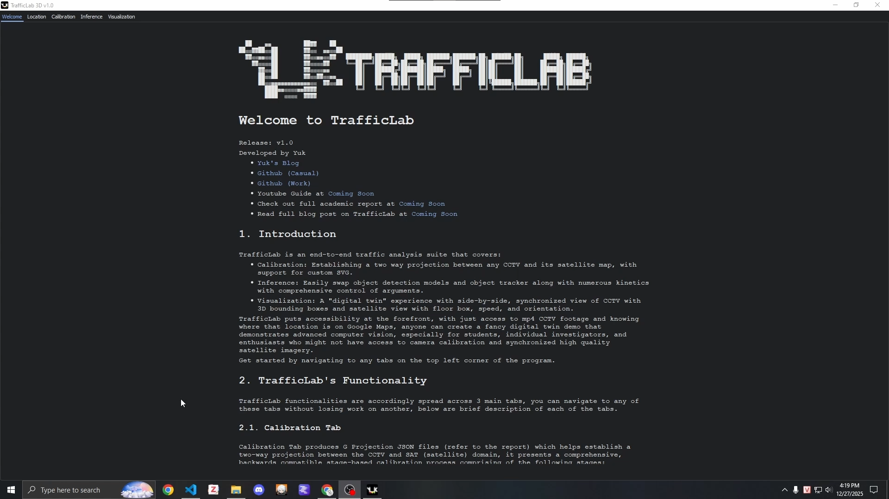
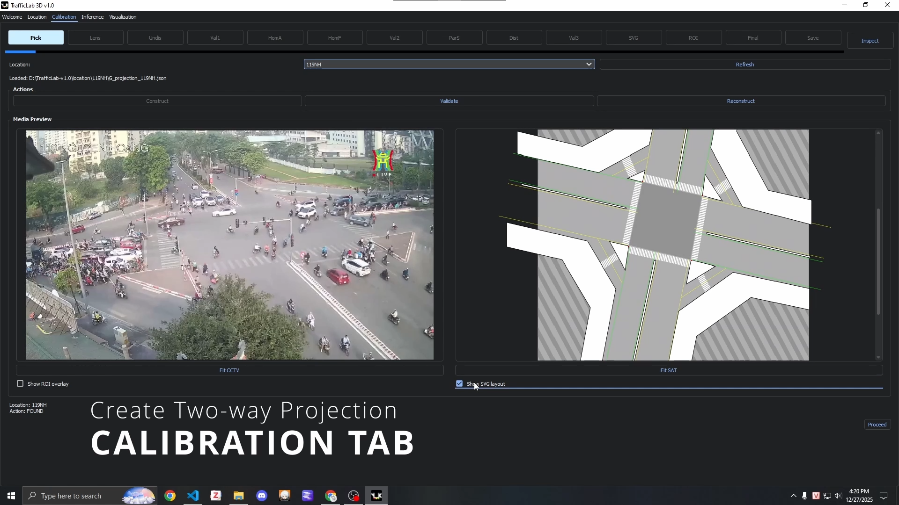
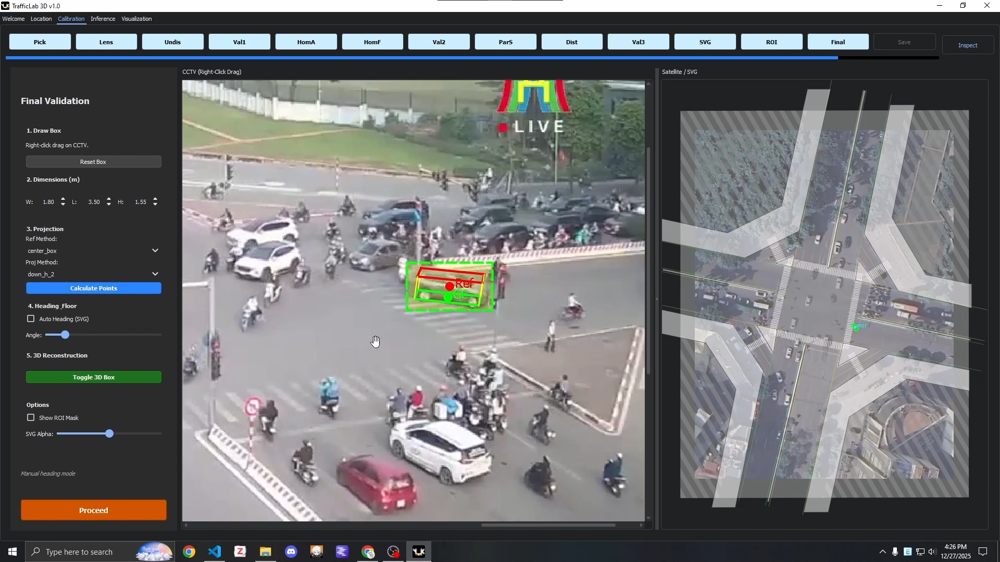
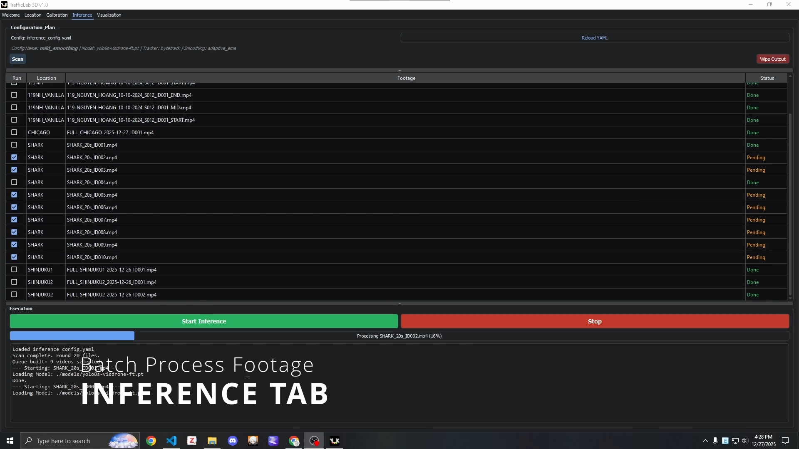
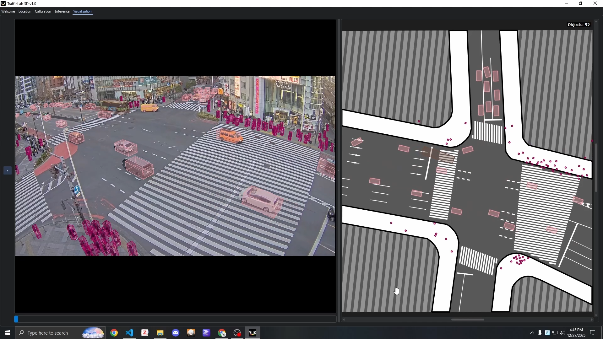

# TrafficLab 3D

TrafficLab puts accessibility at the forefront, with just access to mp4 CCTV footage and knowing where that location is on Google Maps, anyone can create a fancy digital twin demo that demonstrates advanced computer vision, especially for students, individual investigators, and enthusiasts who might not have access to camera calibration and synchronized high quality satellite imagery.


Release: v1.0

Developed by Yuk

- [Yuk's Blog](https://yuk068.github.io/)
- [Github (Casual)](https://github.com/yuk068)
- [Github (Work)](https://github.com/duy-phamduc68)

Complementary resources:

- [Youtube Demo](https://www.youtube.com/watch?v=AYUXXnzenvk)
- Youtube Guide at [Coming Soon](https://yuk068.github.io/)
- Check out full academic report at [Coming Soon](https://yuk068.github.io/)
- Read full blog post on TrafficLab at [Coming Soon](https://yuk068.github.io/)

**It is very recommended that you read through this README if you want to run this program on your own machine. Click [here](#getting-started) to jump to Getting Started**

```
TrafficLab-3D/
├── location/
│   └── {location_code}/
│       ├── footage/
│       │   └── *.mp4
│       │
│       ├── illustrator/                 (optional, Adobe Illustrator assets)
│       │   ├── layout_{location_code}.ai
│       │   ├── roi_{location_code}.ai
│       │   └── *.ai
│       │
│       ├── G_projection_{location_code}.json
│       ├── cctv_{location_code}.png     (critical!)
│       ├── sat_{location_code}.png      (critical!)
│       ├── layout_{location_code}.svg   (optional)
│       └── roi_{location_code}.png      (optional)
│
├── media/                               (resources for README and Introduction tab)
│
├── gui/                                 (GUI implementation)
│
├── models/                              (object detection & tracker models)
│   └── *.pt                             (YOLO checkpoints)
│
├── output/
│   └── model-{model_name}_tracker-{tracker_name}/
│       └── {config-name}/
│           └── {location_code}/
│               └── *.json.gz             (inference outputs)
│
├── environment.yml
├── inference_config.yaml
├── prior_dimensions.json
└── main.py
```

## Introduction

TrafficLab is an end-to-end traffic analysis suite that covers:

- **Calibration:** Establishing a two way projection between any CCTV and its satellite map, with support for custom SVG.
- **Inference:** Easily swap object detection models and object tracker along with numerous kinetics and comprehensive control of arguments.
- **Visualization:** A "digital twin" experience with side-by-side, synchronized view of CCTV with 3D bounding boxes and satellite view with floor box, speed, and orientation.



Get started by navigating to any tabs on the top left corner of the program.

## Functionality

TrafficLab functionalities are spread across 3 main tabs, you can navigate to any of these tabs without losing work on another, below are brief description of each of the tabs.

### Calibration Tab



Calibration Tab produces G Projection JSON files (refer to the report) which helps establish a two-way projection between the CCTV and SAT (satellite) domain, it presents a comprehensive, backwards compatible stage-based calibration process comprising of the following stages:

- **Phase 1:** Undistort
  - **Pick Stage:** Quickly validate and initialize construction/reconstruction of G Projection for a given location code.
  - **Lens Stage:** Configure intrinsics matrix K.
  - **Undistort Stage:** Adjust distortion coefficients obeying the Brown-Conrady distortion model (5 coefficients).
  - **Validation 1:** You can confirm the distortion and intrinsics, concluding the Phase.
- **Phase 2:** Homography
  - **Homography Anchors Stage:** Manual pair point based homography computation with RANSAC solver.
  - **Homography FOV Stage:** Check the warped CCTV overlaid on the SAT map, which also doubles up as a FOV polygon for intuitive visualization.
  - **Validation 2:** Click a ground contact point in CCTV and see it shows up on SAT map.
- **Phase 3:** Parallax
  - **Parallax Subjects Stage:** Establish Head and Ground Contact point of 2 Subjects, input their height, calculate the camera's position.
  - **Distance Reference Stage:** Enter the distance (obtainable from Google Maps/Earth) to establish pixel per meter ratio.
  - **Validation 3:** Click head point, enter height, see ground contact point in CCTV and actual position on SAT map.
- **Optional:**
  - **SVG Stage:** Compute affine matrix between SVG and SAT.
  - **ROI Stage:** Choose a discard strategy for ROI.
- **Final Validation:** Test how 2D bounding box converts to 3D box in CCTV and floor box in SAT.
- **Save Stage:** Confirm saving a G Projection for the location code.



**Note: Location Code:**

You will have to prepare the necessary folders and files to perform calibration, there is also a Location Tab to help you with creating the barebone location folder, ready for calibration. you can create custom SVG and ROI using Adobe Illustrator, refer to the blog post/Youtube video for a more detailed guide on crafting said resources.


### Inference Tab



Inference Tab is a Hub for you to keep track of all your production of the output JSON files, these files are what are actually used by the visualization engine, eliminating the need to perform demanding computation on top of heavy rendering. For arguments, you will control them through `inference_config.yaml` and `prior_dimensions.json` in the project's root. JSON will be saved as the compressed `.json.gz` format for storage efficiency. Controllable arguments includes:

- Object detection model.
- Object tracker.
- Speed and orientation smoothing kinematics.

### Visualization Tab



The visualization engine for the output JSON files, features comprehensive controls via a tool bar and keyboard shortcuts, flexible side by side view of CCTV and SAT panel.

## Getting Started

Install the necessary conda/venv environment, then run `main.py`:

```bash
conda env create -f environment.yml
python main.py
```

In this [Google Drive](https://drive.google.com/drive/folders/14NVnbrUUfII3tRdI8OOEPnLzKbs3SPvn?usp=sharing), you can find:

- Some finetuned `YOLOv8-s` and `YOLOv11-s` models for the `models/` folder.
- Two folders of the same location code with their projection constructed, 1 with SVG and 1 without. If you want more pre-constructed projections of different locations then contact me. Put these in `location`.
- One preprocessed `.json.gz` output file ready for visualization (need the `119NH` folder in `location/` from the same Drive).

## Roadmap

### For TrafficLab

In **TrafficLab 3D v1.1**, I aim for:

- More research needed for smoother, physically-constrained kinematics and tracking.
- Refine Calibration Tab. Maybe some options for automatic calibration.

**Note:** this method only works on a singular flat planar environment.

### Long-term Vision

I wish to scale this idea to be city-wide, with automatic calibration + continuous detector & tracker improvement. Eventually being sufficient for high-fidelity downstream tasks such as simulation, digital twin, natural language query, reinforcement learning, etc...